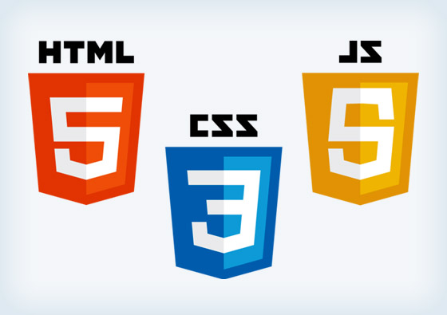

<!-- Название -->
<div align="center">
    
    <h1> My first project on GitHub</h1>
</div>

# FE_project 

### Установка
<!-- Запуск -->
С помощью консоли запустить следующие команды: 
```
- git clone https://github.com/ZazzizzuzA/FE_project.git 
- npm i 
- npm run dev 
```
<!-- Описание -->
### Описание

Этот проэкт длится на протяжении всего обучения курсу по Front-end Develodment'у. 

### Цели 

Ознакомление со всеми необходимыми плагинами, програмным обеспечением, модульными пакетами и т. п., без которых работа с любыми проэктами и вообще в качестве "фронтенда" невозможна. 
> Он не нацелен на красивое оформление. Основная задача - работающий код, а также валидность, но второе стремится к Infinity.

<!-- Архитектура -->
### Архитектура проэкта 

Всё, что использовалось для создания данного проэкта. 

|Название|Версия|Заменено/дополнено|Чем заменено/дополнено| 
|:------:|:----:|:------:|:----------| 
|[**'Webpack'**]|['3.11.0']|['-']|['-']| 
|[**'webpack-dev-server'**]|['2.11.1']|['-']|['-']|
|[**'Vue'**]|['2.5.13']|['-']|['-']| 
|[**'Pug'**]|['2.0.0-rc.4']|['-']|['-']| 
|[**'SCSS'**]|['3']|['-']|['-']| 
|[**'HTML-tags'**]|['5']|['Да']|['Pug']| 
|[**'MVC'**]|['-']|['Да']|['Vue']| 
|[**'CSS'**]|['3']|['Да']|['Scss']|


<!-- 1. Название проэкта
	2. как его запустить: 
		- git clone https://github.com/ZazzizzuzA/FE_project.git
		- npm i
		- npm run dev

	3. Описание
	4. Рассказать про архитектуру -->